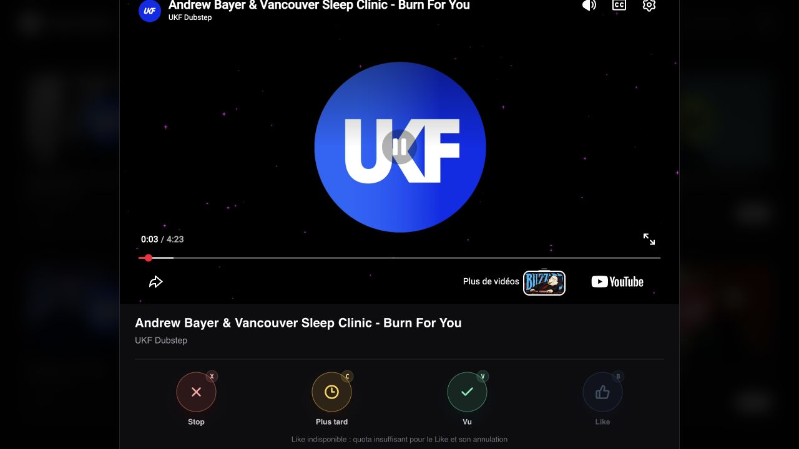
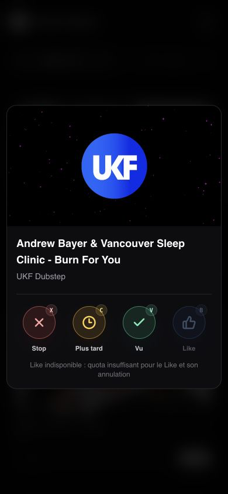
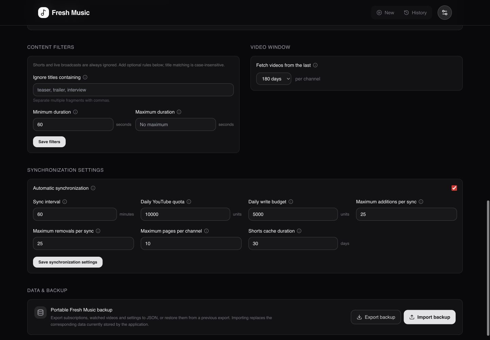

# Fresh Music Release Tracker

A minimalist dashboard that tracks music releases from selected YouTube channels and can maintain a private listening queue in YouTube and YouTube Music.


## Features

- **Automatic YouTube playlist:** Adds unwatched releases to a private `Fresh Music — Nouveautés` playlist at a configurable interval (hourly by default).
- **YouTube and YouTube Music:** The playlist is available in both apps. YouTube Music only surfaces videos it recognizes as music.
- **Two-way queue state:** Marking a video watched in Fresh Music removes it from the playlist. Removing a managed item in YouTube marks it watched at the next sync.
- **New Releases:** Fetches recent uploads from curated channels and excludes YouTube Shorts plus current, upcoming, and completed live broadcasts. The grid keeps a quick **Seen** action on every card.
- **Fast review flow:** Review the loaded New queue with four explicit decisions: **Stop** (`X`), **Later** (`C`), **Seen** (`V`), and **Like** (`B`). YouTube keeps control of the arrow keys.
- **Undoable actions:** The latest decision can be undone from the top notification for six seconds. A YouTube Like restores the account's previous rating when undone.
- **Configurable filters:** Optionally ignore case-insensitive title fragments and videos outside a minimum/maximum duration.
- **Configurable Lookback:** Choose a discovery window from 7 days to 1 year.
- **Local catalogue:** Discovery metadata, history, integration state, quota diagnostics, and settings are stored in SQLite. Dashboard tabs never query YouTube directly.
- **Clean Player:** Review New releases with the decision flow, while History keeps its previous/next navigation.

YouTube does not expose a user's watch history through its official API. Playing a track in YouTube or YouTube Music does not remove it automatically: remove it from the playlist or mark it watched in Fresh Music.

The YouTube Data API exposes reliable live-broadcast metadata but no official `isShort` field. Fresh Music checks the YouTube `/shorts/{videoId}` route for videos up to three minutes long; this HTTP `HEAD` request does not consume Data API quota. Results are cached in SQLite for 30 days and new checks are limited to five concurrent requests. If the best-effort check fails, the video is kept rather than hiding a possible music release.

## Review New releases

Opening any card starts a one-pass session from that video. **Later** moves forward without changing its status, **Seen** removes it from New, and **Like** waits for YouTube confirmation before marking it seen. **Stop**, `Escape`, or the backdrop closes the player.

| Key | Action | Result |
| --- | --- | --- |
| `X` | Stop | Close the player without changing the video. |
| `C` | Later | Continue without marking the video seen; it stays in the grid. |
| `V` | Seen | Mark the video seen and open the next one. |
| `B` | Like | Like through the connected YouTube account, mark it seen, and continue. |

Keys and buttons share the same pressed, release, stamp, and card-transition feedback. Shortcuts are active only while Fresh Music owns focus; when the YouTube iframe has focus, its own shortcuts remain available.



<p align="center">
  
</p>

## Settings

The dedicated Settings page centralizes the whole YouTube integration and the local catalogue configuration:

- **Automatic playlist status:** Connected account, direct YouTube and YouTube Music links, last and next synchronization, pending additions/removals, detailed run results, and manual synchronization controls.
- **Quota monitoring:** Estimated daily usage, the separate playlist-write budget, remaining mutations, reset time, and visible warnings before or after a limit is reached.
- **Channel management:** Search YouTube, follow new channels, and remove existing subscriptions from the local catalogue.
- **Content selection:** Case-insensitive excluded title fragments, minimum/maximum duration, and a per-channel discovery window from 7 days to 1 year. Shorts and live broadcasts remain excluded automatically.
- **Synchronization controls:** Enable scheduling and configure its interval, total/write budgets, per-run addition and removal limits, discovery depth, and Shorts cache duration without restarting Fresh Music.
- **Portable backup:** Export channels, watched videos, and settings to JSON or restore them from a previous export.


The advanced controls keep content filters and the video window side by side on desktop, followed by synchronization limits and backup controls.



## Google Cloud setup

1. Create or select a project in the [Google Cloud Console](https://console.cloud.google.com/).
2. Enable **YouTube Data API v3**.
3. Create an API key for public video and channel discovery.
4. Configure the OAuth consent screen. For a personal instance, publish the app to **In production** so the refresh token does not expire after seven days. A personal app can remain unverified, with Google's warning during consent.
5. Create an OAuth 2.0 **Web application** client and register this exact redirect URI:

   ```text
   https://your-fresh-music-host.example/api/youtube/auth/callback
   ```

6. Generate the token-encryption key once and keep it stable with the persisted database:

   ```bash
   openssl rand -base64 32
   ```

Fresh Music requests only `https://www.googleapis.com/auth/youtube.force-ssl`. OAuth tokens remain encrypted in SQLite and are never sent to the browser.

## Configuration

| Variable | Required | Description |
| --- | --- | --- |
| `YOUTUBE_API_KEY` | Yes | YouTube Data API key used at runtime. |
| `GOOGLE_CLIENT_ID` | For playlist sync | OAuth web client ID. |
| `GOOGLE_CLIENT_SECRET` | For playlist sync | OAuth web client secret. |
| `GOOGLE_TOKEN_ENCRYPTION_KEY` | For playlist sync | Stable, base64-encoded 32-byte key. |
| `APP_BASE_URL` | For playlist sync | Public origin without a trailing slash, such as `https://music.example.com`. |
| `DB_PATH` | No | SQLite path; defaults to `./data/freshmusic.db` and `/app/data/freshmusic.db` in Docker. |

Synchronization interval, quota budgets, per-run limits, discovery pagination and the Shorts cache duration are configured from the dedicated **Settings & Backup** page and persisted in SQLite.
The deprecated `PLAYLIST_SYNC_INTERVAL_MINUTES` variable is read only once when migrating an older database; use the interface afterwards.

## Docker

Mount `/app/data` and pass secrets at runtime. Do not bake OAuth credentials into the image.

```bash
docker run -p 3000:3000 \
  -e YOUTUBE_API_KEY=YOUR_API_KEY \
  -e GOOGLE_CLIENT_ID=YOUR_CLIENT_ID \
  -e GOOGLE_CLIENT_SECRET=YOUR_CLIENT_SECRET \
  -e GOOGLE_TOKEN_ENCRYPTION_KEY=YOUR_STABLE_BASE64_KEY \
  -e APP_BASE_URL=https://your-fresh-music-host.example \
  -v fresh-music-data:/app/data \
  ghcr.io/lilgallon/fresh-music:latest
```

Docker Compose:

```yaml
services:
  fresh-music:
    image: ghcr.io/lilgallon/fresh-music:latest
    ports:
      - "3000:3000"
    environment:
      YOUTUBE_API_KEY: ${YOUTUBE_API_KEY}
      GOOGLE_CLIENT_ID: ${GOOGLE_CLIENT_ID}
      GOOGLE_CLIENT_SECRET: ${GOOGLE_CLIENT_SECRET}
      GOOGLE_TOKEN_ENCRYPTION_KEY: ${GOOGLE_TOKEN_ENCRYPTION_KEY}
      APP_BASE_URL: ${APP_BASE_URL}
    volumes:
      - fresh-music-data:/app/data

volumes:
  fresh-music-data:
```

## Development

Create `.env.local`:

```env
YOUTUBE_API_KEY=your_api_key
GOOGLE_CLIENT_ID=your_oauth_client_id
GOOGLE_CLIENT_SECRET=your_oauth_client_secret
GOOGLE_TOKEN_ENCRYPTION_KEY=your_stable_base64_key
APP_BASE_URL=http://localhost:3000
```

Register `http://localhost:3000/api/youtube/auth/callback` as a development redirect URI, then run:

```bash
npm ci --legacy-peer-deps
npm run dev
```

Validation commands:

```bash
npm test
npm run lint
npm run build
```
