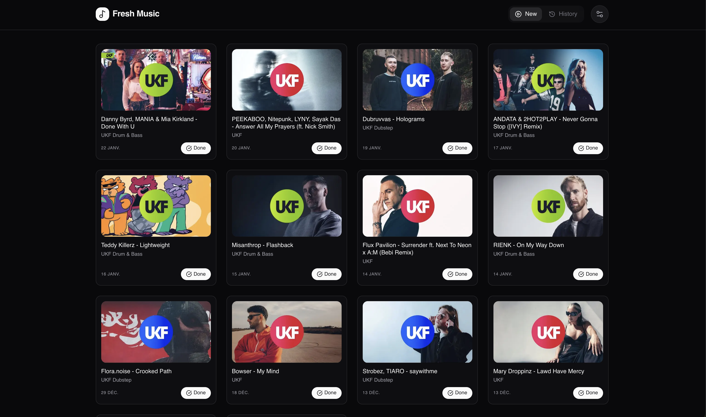
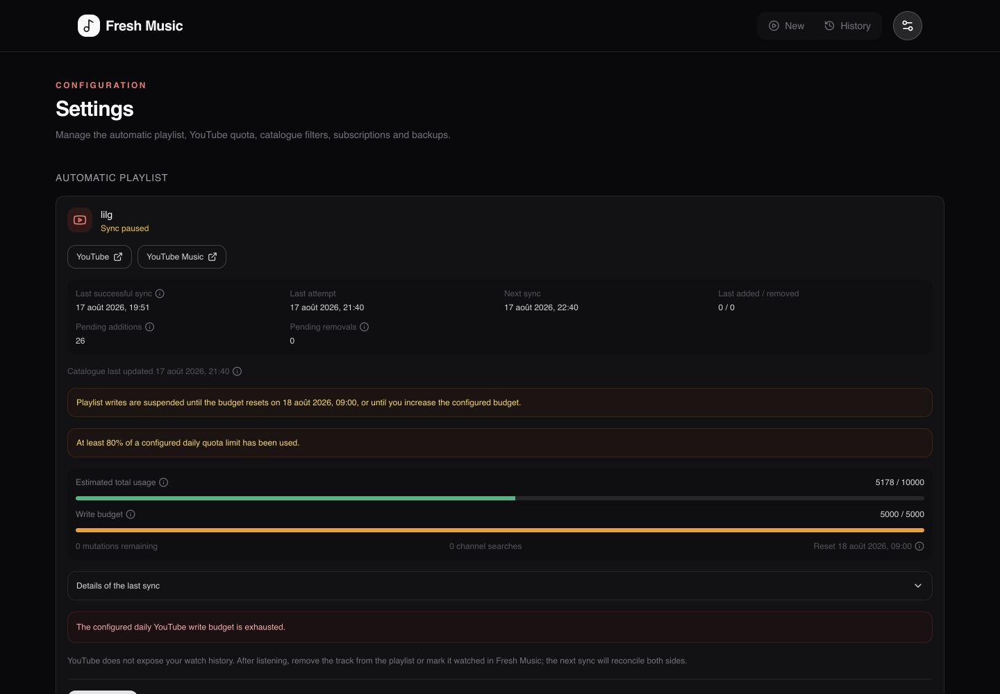

# Fresh Music Release Tracker

A minimalist dashboard that tracks music releases from selected YouTube channels and can maintain a private listening queue in YouTube and YouTube Music.





## Features

- **Automatic YouTube playlist:** Adds unwatched releases to a private `Fresh Music — Nouveautés` playlist every hour.
- **YouTube and YouTube Music:** The playlist is available in both apps. YouTube Music only surfaces videos it recognizes as music.
- **Two-way queue state:** Marking a video watched in Fresh Music removes it from the playlist. Removing a managed item in YouTube marks it watched at the next sync.
- **New Releases:** Fetches recent uploads from curated channels and filters videos of 60 seconds or less when duration metadata is available.
- **Configurable Lookback:** Choose a discovery window from 7 days to 1 year.
- **Server-side Persistence:** Channels, watched videos, integration state, and settings are stored in SQLite. `localStorage` remains an offline UI cache.
- **Clean Player:** Watch videos in the dashboard with previous/next navigation.

YouTube does not expose a user's watch history through its official API. Playing a track in YouTube or YouTube Music does not remove it automatically: remove it from the playlist or mark it watched in Fresh Music.

## Google Cloud setup

1. Create or select a project in the [Google Cloud Console](https://console.cloud.google.com/).
2. Enable **YouTube Data API v3**.
3. Create an API key for public video and channel discovery.
4. Configure the OAuth consent screen. For a personal instance, publish the app to **In production** so the refresh token does not expire after seven days. A personal app can remain unverified, with Google's warning during consent.
5. Create an OAuth 2.0 **Web application** client and register this exact redirect URI:

   ```text
   https://your-fresh-music-host.example/api/youtube/auth/callback
   ```

6. Generate the token-encryption key once and keep it stable with the persisted database:

   ```bash
   openssl rand -base64 32
   ```

Fresh Music requests only `https://www.googleapis.com/auth/youtube.force-ssl`. OAuth tokens remain encrypted in SQLite and are never sent to the browser.

## Configuration

| Variable | Required | Description |
| --- | --- | --- |
| `YOUTUBE_API_KEY` | Yes | YouTube Data API key used at runtime. |
| `GOOGLE_CLIENT_ID` | For playlist sync | OAuth web client ID. |
| `GOOGLE_CLIENT_SECRET` | For playlist sync | OAuth web client secret. |
| `GOOGLE_TOKEN_ENCRYPTION_KEY` | For playlist sync | Stable, base64-encoded 32-byte key. |
| `APP_BASE_URL` | For playlist sync | Public origin without a trailing slash, such as `https://music.example.com`. |
| `PLAYLIST_SYNC_INTERVAL_MINUTES` | No | Sync interval, clamped to 5–1440 minutes; defaults to `60`. |
| `DB_PATH` | No | SQLite path; defaults to `./data/freshmusic.db` and `/app/data/freshmusic.db` in Docker. |
| `NEXT_PUBLIC_YOUTUBE_API_KEY` | Development/build only | Optional client-bundle API key retained for the existing dashboard. |

## Docker

Mount `/app/data` and pass secrets at runtime. Do not bake OAuth credentials into the image.

```bash
docker run -p 3000:3000 \
  -e YOUTUBE_API_KEY=YOUR_API_KEY \
  -e GOOGLE_CLIENT_ID=YOUR_CLIENT_ID \
  -e GOOGLE_CLIENT_SECRET=YOUR_CLIENT_SECRET \
  -e GOOGLE_TOKEN_ENCRYPTION_KEY=YOUR_STABLE_BASE64_KEY \
  -e APP_BASE_URL=https://your-fresh-music-host.example \
  -v fresh-music-data:/app/data \
  ghcr.io/lilgallon/fresh-music:latest
```

Docker Compose:

```yaml
services:
  fresh-music:
    image: ghcr.io/lilgallon/fresh-music:latest
    ports:
      - "3000:3000"
    environment:
      YOUTUBE_API_KEY: ${YOUTUBE_API_KEY}
      GOOGLE_CLIENT_ID: ${GOOGLE_CLIENT_ID}
      GOOGLE_CLIENT_SECRET: ${GOOGLE_CLIENT_SECRET}
      GOOGLE_TOKEN_ENCRYPTION_KEY: ${GOOGLE_TOKEN_ENCRYPTION_KEY}
      APP_BASE_URL: ${APP_BASE_URL}
      PLAYLIST_SYNC_INTERVAL_MINUTES: 60
    volumes:
      - fresh-music-data:/app/data

volumes:
  fresh-music-data:
```

## Development

Create `.env.local`:

```env
NEXT_PUBLIC_YOUTUBE_API_KEY=your_api_key
YOUTUBE_API_KEY=your_api_key
GOOGLE_CLIENT_ID=your_oauth_client_id
GOOGLE_CLIENT_SECRET=your_oauth_client_secret
GOOGLE_TOKEN_ENCRYPTION_KEY=your_stable_base64_key
APP_BASE_URL=http://localhost:3000
PLAYLIST_SYNC_INTERVAL_MINUTES=60
```

Register `http://localhost:3000/api/youtube/auth/callback` as a development redirect URI, then run:

```bash
npm ci --legacy-peer-deps
npm run dev
```

Validation commands:

```bash
npm test
npm run lint
npm run build
```
